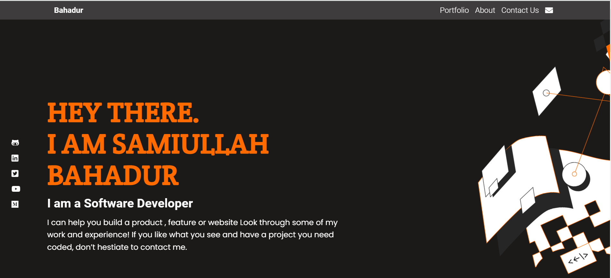

# Samiullah Bahadur Portfolio

> Portfolio project about Samiullah Bahadur

> 

> In this Project, I used HTML and CSS (Media, Transition, flexbox, Grid and figma template)

You can download my project copy this link(git@github.com:samiullahbahadur/Portfolio.git) and git clone paste the link in the terminal

## Built With

- HTML
- CSS
- Javascript

## Live Demo

- [Bahadur-Portfolio](https://samiullahbahadur.github.io/Portfolio/).

👤 **Samiullah Bahadur**

- GitHub: [@samiullahbahadur](https://github.com/samiullahbahadur)
- Twitter: [@samiullahbahadur](https://twitter.com/@Samiull88496331)
- LinkedIn: [@samiullahbahadur](https://linkedin.com/in/samiullah-bahadur-a1b053149/)

## Show your support

Give a ⭐️ if you like this project!

## 📝 License

This project is [MIT](LICENSE.md) licensed.
